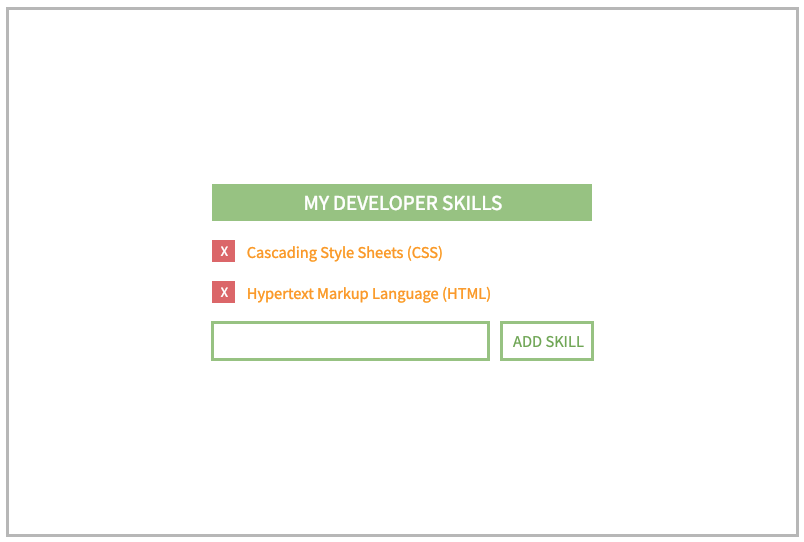

# My Developer Skills List 

## Wireframe

## Requirements

Add HTML and CSS as necessary to implement an application that looks close to the wireframe.

User (AAU) has the ability to type in a skill and have it added to "my developer skills" by clicking "add skill" button. 

AUU has the ablility to remove an individual skill.

## Try it out 

Try My Developer Skills: [<b>HERE</b>](https://jessicamaev.github.io/my-developer-skills/)
